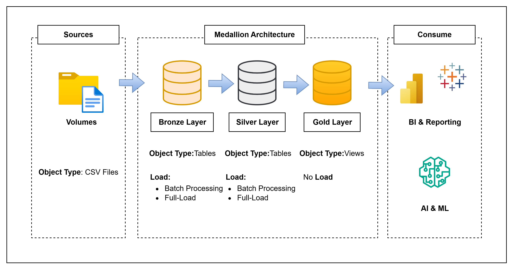

# 🚀Project Overview
- This project builds a Data Warehousing and Analytics solution that consolidates and transforms data from CSV files. Using the Medallion Architecture (Bronze → Silver → Gold), the system ensures clean, reliable data that supports business intelligence, reporting, and advanced analytics. 

## General Principle
- **Naming Conventions**: Use PascalCase as the naming convention and no spaces on each word. ie. tablename -> SalesOrder
    - Use naming of **key** instead of the **_GUID**. ie Date Keys -> DateKey

## Data Architecture Diagram

## Source Data
- **Files**: Data will be sourced the csv. This will generated mock data and manipulated in excel for batch processing. 

## Tables

### Dimension

| Table        | Description                                                   |
| ------------ | ------------------------------------------------------------- |
| **Customer** | Stores customer details; determines who placed orders.        |
| **Product**  | Stores product details; used for Qty and Unit Price in sales. |
| **Facility** | Stores facility/location details where items are ordered.     |

### Fact
| Table               | Description                                                           |
| ------------------- | --------------------------------------------------------------------- |
| **OrderHeader**     | Tracks orders with statuses (Pending, Cancelled, Shipped, Confirmed). |
| **OrderDetails**    | Tracks detailed line items per order.                                 |
| **CashTransaction** | Records cash received from customers.                                 |

### Aggregate Fact Tables
| Table                      | Description                                                              |
| -------------------------- | ------------------------------------------------------------------------ |
| **FactSales**              | Aggregates sales (e.g., sales per quarter).                              |
| **FactRankedItems**        | Identifies top shipped items.                                            |
| **FactAccountsReceivable** | Tracks unpaid items past due date.                                       |
| **FactCashVelocity**       | Measures how quickly cash is collected from sales.                       |
| **FactReceivableDays**                | Calculates average days to collect receivables (Days Sales Outstanding). |

## Optional:
- generation of the powerbi report
- devops to encapsulate the db in docker files

